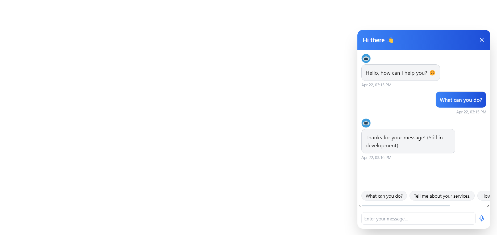

# Chatbot Widget 💬

A modern AI chatbot UI built with React + Tailwind CSS. Supports text, microphone input, and chat history.

 <!-- Nếu bạn có ảnh chụp giao diện -->

## 🚀 Features

- Send/receive chat messages
- Streaming bot response
- Microphone support
- Chatbot avatar & timestamp
- Suggestions

# Install dependencies

cd ./chatbot-ui
npm install

# Run development server

npm run dev

# hoặc nếu bạn dùng CRA (create-react-app)

npm start

# Build for production

npm run build
